##Introduction
This guide will go through the full steps to integrate the Windows SDK for Facebook into your Universal app through a 
sample application that highlights the key feature set of the SDK. The app is a simple XAML/C# UWP app that utilizes buttons
for each feature of the SDK. The app is called Windows SDK Test App and we will refer to it as "FBTestApp" in the rest of this tutorial.

To complete the tutorial, you'll need some familiarity with Universal Windows app development. In particular, you will need
Visual Studio 2015 and know how to create/debug UWP apps written in C# and XAML. 

##Setting up your Facebook Application
Before you can get started, you will have to go to the [Facebook Developer Portal](www.developers.facebook.com/apps) and
get a Facebook AppId. Once you have created your application, create a Universal Windows blank app in C#. From there, you will
need to get the Windows Store ID and Windows Phone SID for your application. The full steps to getting set up are [here](../index.html)
but we will go over it again for this sample app. 

Use this code snippet to get your Windows Store ID:

C#:


using Windows.Security.Authentication.Web;
...
string SID = WebAuthenticationBroker.GetCurrentApplicationCallbackUri().ToString();


C++:


using namespace Windows::Security::Authentication::Web;
...
String^ SID = WebAuthenticationBroker::GetCurrentApplicationCallbackUri()->DisplayUri;

        
This will return a string with value "ms-app://<SID>". The part after the // is the Windows Store ID or SID. 
Now, to get the Windows Phone SID for your application, open the Package.appxmanifest file. Look for the mp:PhoneIdentity
tag and the corresponding PhoneProductID as seen in the image below.

**Windows Phone SID**
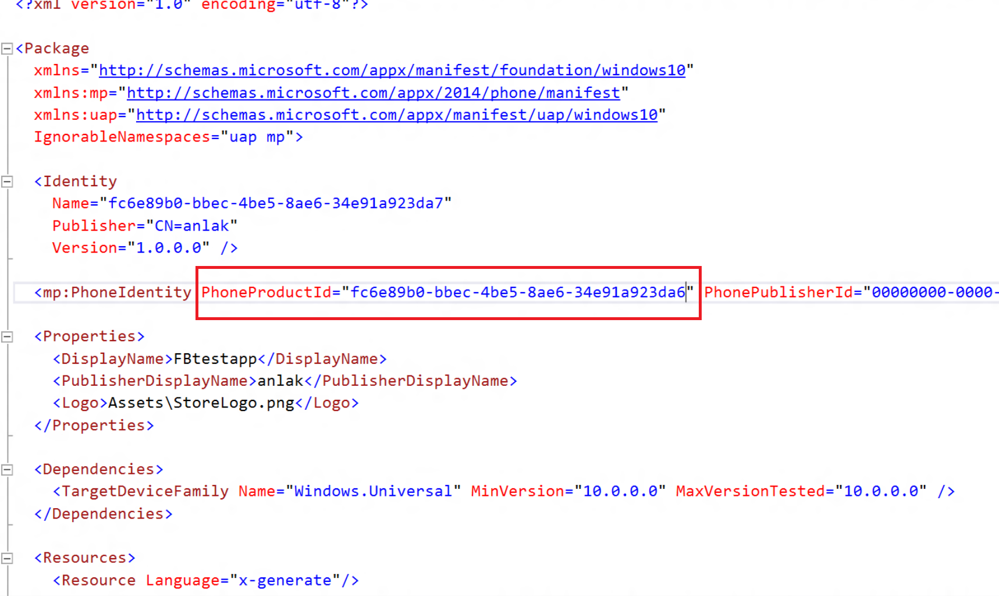

Now that you have the Windows Store ID and the Phone SID, go back to the developers.facebook.com page and on the "Basic" tab
under "Settings" from the left menu, add "Windows App" as a platform and enter the Windows Store ID in the Windows Store ID textbox
and the Windows Phone SID in the Windows Phone Store ID textbox. See the image below for clarification.

**Facebook Developer Portal**
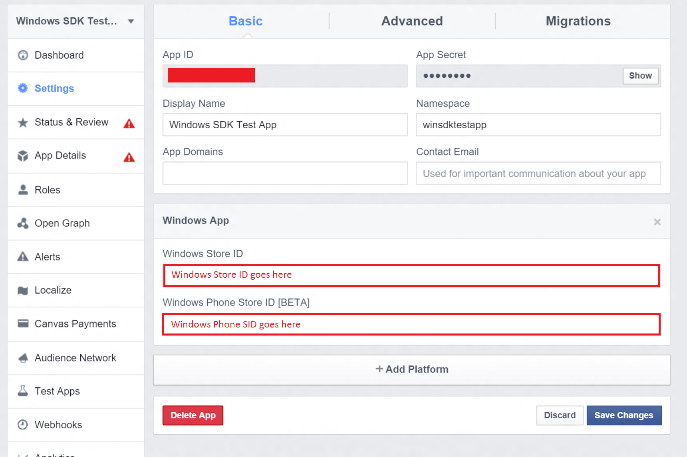

You will also need to enable OAuth login on the Facebook App Developer Portal. In the same "Settings" page of your app, click on the "Advanced tab". Near the bottom of the page will be an "OAuth Settings" section. In this section, enable both "Client OAuth Login" as well as "Embedded Browser OAuth Login". Make sure to click on "Save Changes" at the end as well.

Finally, you have to include the Project within your solution. For Universal Windows 10 applications, you can use the [nuget package](https://www.nuget.org/packages/winsdkfb). Go to the Nuget package manager and search for "winsdkfb" in the Nuget package explorer. 

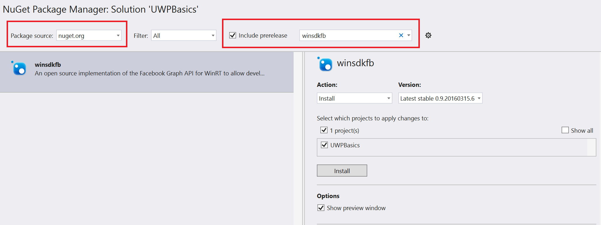

For Windows Store/Phone 8.1 projects, either clone the [github repo](www.github.com/Microsoft/winsdkfb) or download it as a zip. Open up your app within Visual Studio. Right click on the solution and select "Add -> Existing Project". From there, go to where you downloaded the winsdkfb source and pull in the "winsdkfb_uwp.vcxproj" file within the "winsdkfb_uwp" folder. Then,
add a reference to the winsdkfb project from your app's project by right-clicking on your project and selecting "Add -> Reference". See images below for details.

**winsdkfb vcxproj**
 

**Add reference**
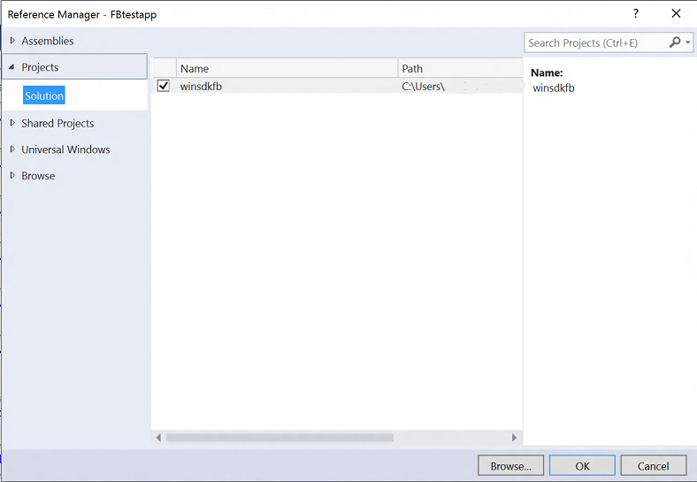

##Configuring Facebook Login and Profile Picture control
Once you have everything set up as mentioned above, you are ready to go into your project and integrate the Facebook SDK features. The
first and most important feature to integrate is Facebook Login/Authentication. You can follow the steps outlined [here](../auth), but we will go over the relevant code snippets and expected output. In our test app, we configure each XAML UI button to be tied to a specific feature. For login, you can create a custom XAML UI button or you can use the Login UI button provided by the SDK. Note that you have to have the **"xmlns:fbsdk="using:winsdfkb"** set in your XAML to get the UI controls. You can see the XAML UI for each of the buttons here:

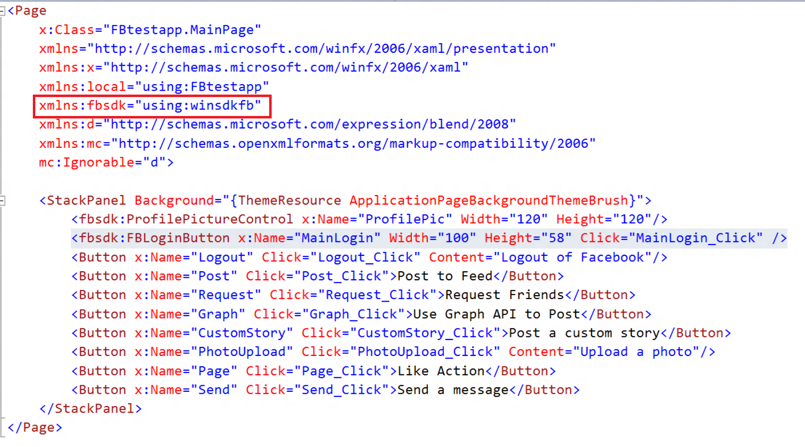

In this app, the XAML page file is called MainPage.XAML. After this step, we can jump to the MainPage.XAML.cs file so that we can enter in the code to set up login. An easy way to do this is to look at the Design tab on the XAML page, and double click the button you have set up for Login. In this case, it is the "MainLogin" button. Within the MainLogin_Click function, enter in the following code to set up user login.


using winsdkfb;
...
private async void MainLogin_Click(object sender, RoutedEventArgs e)
{
    FBSession sess = FBSession.ActiveSession;
    sess.FBAppId = "<Your Facebook App ID here>";
    sess.WinAppId = "<Your Windows Store ID here>";
    List<String> permissionList = new List<String>();
    permissionList.Add("public_profile");
    permissionList.Add("user_friends");
    permissionList.Add("user_likes");
    permissionList.Add("user_location");
    permissionList.Add("user_photos");
    permissionList.Add("publish_actions");
    FBPermissions permissions = new FBPermissions(permissionList);

    // Login to Facebook
    FBResult result = await sess.LoginAsync(permissions);
    if (result.Succeeded)
    {
        FBUser user = sess.User;
        ProfilePic.UserId = sess.User.Id;
        Debug.WriteLine(sess.User.Id);
        Debug.WriteLine(sess.User.Name);
    }
    else
    {
        //Login failed
    }
}


Note that you have to enter your Facebook App ID from the developer portal as well as the Windows Store ID retrieved in the earlier step to correctly configure your app. Then, create a permissionList object and add in the permissions you want to get from the user. Finally, call the sess.LoginAsync() method with the permissionList you created and then you should see the following Dialog box pop up:

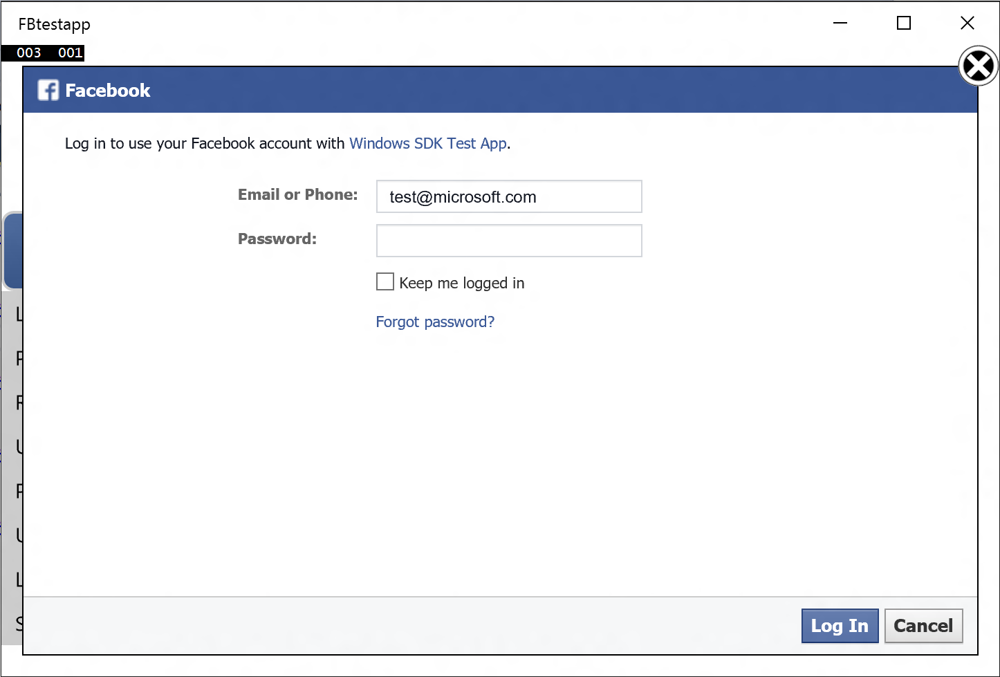

When you are testing your application, you can only use the login credentials associated with the account used on the Facebook Developer Portal site to login. On that portal you can optionally add other developer and tester Facebook accounts, but for the purposes of this example we will stick to the same account we used when registering the app. At this point you should have a successful login - and with the code snippet from above you should see the User ID and the user's full name printed to the console. One key feature to add in is Profile Picture Control. In your XAML file, add in the following line to your code:


<fbsdk:ProfilePictureControl x:Name="ProfilePic" Width="120" Height="120">


This line paired with the earlier code snippet (ProfilePic.UserId = sess.User.Id) should automatically populate the user's profile picture into a small box within your application after log-in. In our sample app, it will look something like this:

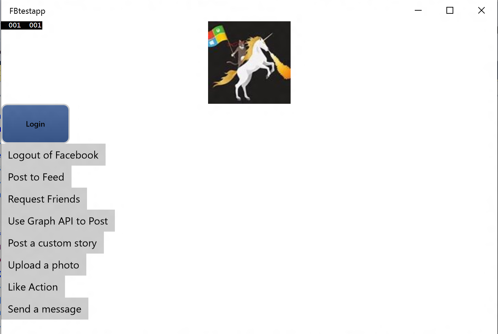

##Dialog Example - Feed Dialog
At this point, the user is authenticated and we want to allow the user to post to their feed through our application. For this purpose, we have the Feed Dialog which posts to the user's timeline. There are other dialogs as well, and if you want to see how they work in more detail you can check out the description [here](../dialogs). For now we will just cover the Feed Dialog. Once again, create any XAML button you want and then open up its function in the MainPage.cs file. Paste the following code snippet into the function:


private async void Post_Click(object sender, RoutedEventArgs e)
{
    FBSession sess = FBSession.ActiveSession;
    if (sess.LoggedIn)
    {
        // Set caption, link and description parameters
        PropertySet parameters = new PropertySet();
        parameters.Add("title", "Microsoft");
        parameters.Add("link", "https://www.microsoft.com/en-us/default.aspx");
        parameters.Add("description", "Microsoft home page");
        // Display feed dialog
        FBResult fbresult = await sess.ShowFeedDialogAsync(parameters);
    }
}


In this example, my function is called "Post_Click" and it is tied to the "Post to Feed" button seen earlier. With the Feed Dialog, you can add parameters to go along with the post. For my button, the post title is "Microsoft" and there is a link to the Microsoft website. When you link to an external website Facebook will automatically load a picture from that webpage. Finally, there is a description that I have set to "Microsoft home page". Once you call the ShowFeedDialogAsync function with the parameters listed above you should see the following pop-up:

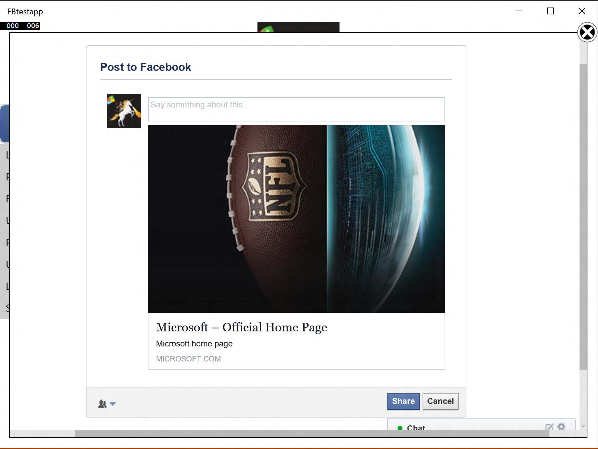

In the area labeled "Say something about this..." is where the user can enter the text of the post to their timeline. In my case, I just entered "Hello World" and clicked "Share" at the bottom of the dialog. Now, if I go to check my Facebook Timeline I will see the post appear like this:

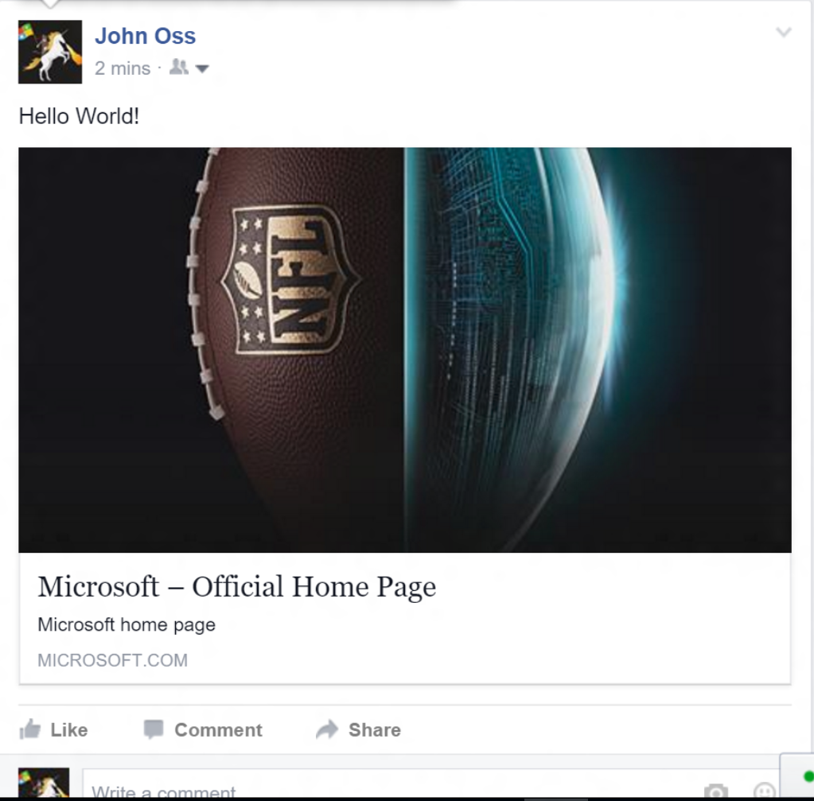

And now any of the user's Facebook friends can interact with the post by liking/sharing/commenting on it as they would on any other post in their News Feed.

##Using the Graph API to Upload a Photo
Another big use case of the Windows SDK for Facebook is interacting with the Graph API. The Graph API is the primary way for apps to read and write to the Facebook social graph. There are numerous endpoints and scenarios but our SDK focuses on some of the key ones. If you want to read more on the Graph API, check out [this link](https://developers.facebook.com/docs/graph-api).

The last example we will cover in this sample app is how to upload a photo to a user's Facebook Timeline. There are other features involving the Graph API that our SDK provides, and for the full list and code snippets you can check out the [graph API section](../graph) of the website. For now, referring back to the sample app, you can create another custom XAML button that will be tied to the photo upload action in the MainPage.xaml.cs file. In our app, this is the button labeled "Upload a Photo" and tied to the PhotoUpload_Click method. In this method, paste the following code snippet:


using winsdkfb;
using winsdkfb.Graph;
...
private async void PhotoUpload_Click(object sender, RoutedEventArgs e)
{
    var fop = new FileOpenPicker();
    fop.ViewMode = PickerViewMode.Thumbnail;
    fop.SuggestedStartLocation = PickerLocationId.PicturesLibrary;
    fop.FileTypeFilter.Add(".jpg");
    fop.FileTypeFilter.Add(".jpeg");
    fop.FileTypeFilter.Add(".png");

    var storageFile = await fop.PickSingleFileAsync();
    var stream = await storageFile.OpenReadAsync();
    var mediaStream = new FBMediaStream(storageFile.Name, stream);
    FBSession sess = FBSession.ActiveSession;
    if (sess.LoggedIn)
    {
        var user = sess.User;
        var parameters = new PropertySet();
        parameters.Add("source", mediaStream);

        string path = "/" + user.Id + "/photos";
        var factory = new FBJsonClassFactory(s => {
              return JsonConvert.DeserializeObject<FBPhoto>(s);
        });

        var singleValue = new FBSingleValue(path, parameters, factory);
        var result = await singleValue.PostAsync();
        if (result.Succeeded)
        {
            var photoResponse = result.Object as FBPhoto;
        }
    }
}


You will also need to create a custom class to handle the response. In this example, it is using a class called FBPhoto and the class can be seen here:


public class FBPhoto
{
    public string Id { get; set; }
    public string Post_Id { get; set; }
}


In this code snippet, the first few lines can be changed based on how you want the photo to be loaded from the filesystem. These are all based on Windows API's that have different options for selecting a photo file. In our example, this code snippet will create a pop up to the file explorer as seen in this diagram:

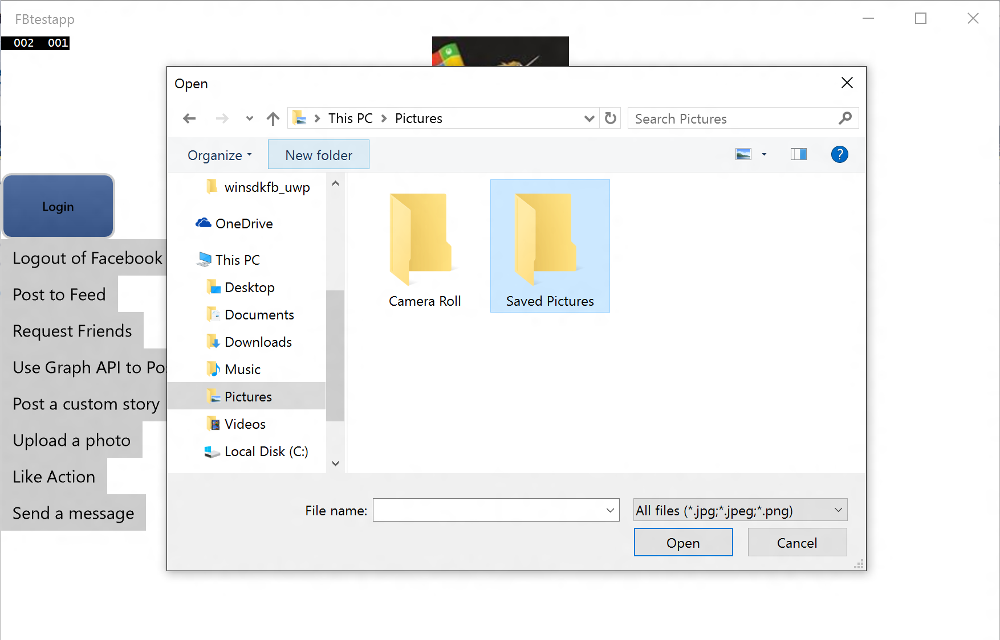

Once the photo has been selected, in our example the dialog box immediately closes and the user is returned to the app. As a developer, you might want to handle the click event differently such that once the dialog closes an alert is shown to the user saying that their action was successful or unsuccessful. Right now, the response from the photo upload is captured in the photoResponse variable. That variable can be inspected to see whether the response was a 200 or an error was thrown. Now, upon a successful photo upload, you can see what it looks like on the user's timeline through this image here:

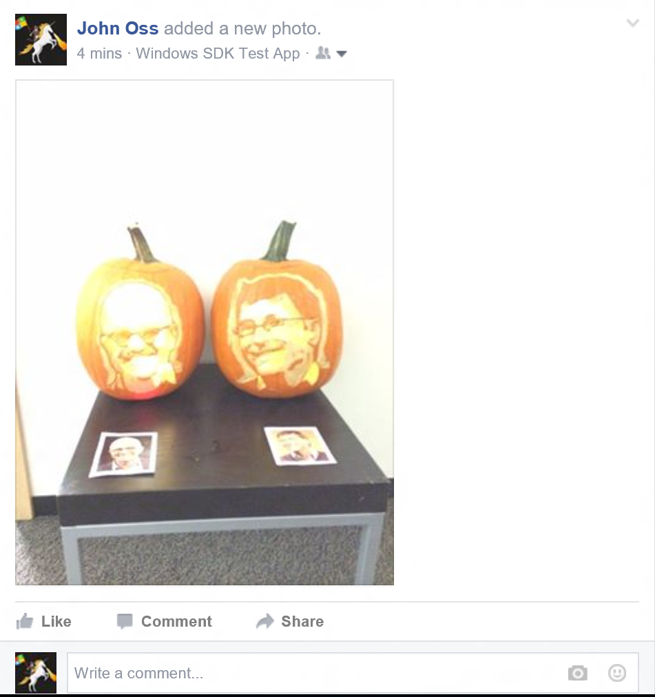

You can see that the post has the text "Windows SDK Test App" to show that the image was uploaded through the app. In this way, as a developer creating your own UWP app, any action such as photo upload will register that it was done through your application so that there is more visibility overall for the app amongst the user's friends on Facebook.

##Conclusion
Now, you have successfully utilized the Windows SDK for Facebook to set up your app, allow user authentication and login, retrieve a user's profile picture, post to the user's timeline and use the Graph API to upload a photo. Feel free to check out the other features of the SDK listed here on the documentation site, or if you have questions/issues/feature requests (or just want to look at the source)
you can view the files on [Github as well](https://github.com/Microsoft/winsdkfb).
